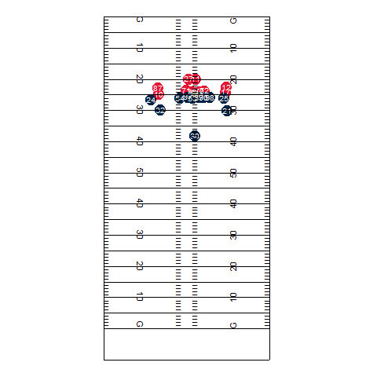

<!-- README.md is generated from README.Rmd. Please edit that file -->
Big Data Bowl 
========================================================

Welcome to the data homepage for the NFL's 2019 Big Data Bowl. Here, you'll find links to XX weeks of player tracking data from [Next Gen Stats](https://nextgenstats.nfl.com/), a style guide with references to each data set and each variable, a list of FAQs for the 2019 contest, and a tutorial on how to visualize and animate the player tracking data using the [R Statistical Software](https://cran.r-project.org/).

What is contained in this repository
------------------------------------

1.  Player tracking data from a subset of games from the 2017 season. See <https://github.com/nfl-football-ops/Big-Data-Bowl/tree/master/Data/Tracking> for the complete list of games. Each game is stored as a unique .csv file.

2.  Player, play, and game-level data that correspond to the tracking data. See <https://github.com/nfl-football-ops/Big-Data-Bowl/tree/master/Data> for each of these .csv files.

3.  A Data schema, which contains information on each of the variables in the data, as well as ways to link the data sets together.

4.  A list of Data FAQs.

A brief tutorial of using the `gganimate` [package](https://github.com/thomasp85/gganimate) in R to animate the tracking data follows.

### Reading in the data

``` r
library(tidyverse)
file.tracking <- "https://raw.githubusercontent.com/nfl-football-ops/Big-Data-Bowl/master/Data/Tracking/tracking_gameId_2017090700.csv?token=ArYlPx05ztvrEtIKTgB9umBui6HviSJMks5cDo3WwA%3D%3D"
tracking.example <- read_csv(file.tracking)

file.game <- "https://raw.githubusercontent.com/nfl-football-ops/Big-Data-Bowl/master/Data/games.csv?token=ArYlP3sUZTHRrsP5-qNkvDdobliwSSJAks5cDo5xwA%3D%3D"
games.sum <- read_csv(file.game) 


file.plays <- "https://raw.githubusercontent.com/nfl-football-ops/Big-Data-Bowl/master/Data/plays.csv?token=ArYlP58hzzHH8tABhMrbz-Lc1gB8zkx3ks5cDo9RwA%3D%3D"
plays.sum <- read_csv(file.plays) 


tracking.example.merged <- tracking.example %>% inner_join(games.sum) %>% inner_join(plays.sum) 

example.play <- tracking.example.merged %>% filter(playId == 2756)

example.play %>% select(playDescription) %>% slice(1)
#> # A tibble: 1 x 1
#>   playDescription                                                          
#>   <chr>                                                                    
#> 1 (9:28) (Shotgun) A.Smith pass deep right to T.Hill for 75 yards, TOUCHDO~
```

The following code will animate the touchdown identified above

``` r

library(gganimate)
library(cowplot)

## Get boundaries for a given play
xmin <- 0
xmax <- 160/3
hash.right <- 38.35
hash.left <- 12
hash.width <- 3.3

ymin <- max(round(min(example.play$x, na.rm = TRUE) - 10, -1), 0)
ymax <- min(round(max(example.play$x, na.rm = TRUE) + 10, -1), 120)
df.hash <- expand.grid(x = c(0, 23.36667, 29.96667, xmax), y = (10:110))
df.hash <- df.hash %>% filter(!(floor(y %% 5) == 0))
df.hash <- df.hash %>% filter(y < ymax, y > ymin)

animate.play <- ggplot() +
  geom_point(data = example.play, aes(x = (xmax-y), y = x, 
                                 colour = team, group = nflId, pch = team, size = team)) + 
  geom_text(data = example.play, aes(x = (xmax-y), y = x, label = jerseyNumber), colour = "white", 
            vjust = 0.36, size = 3.5) + 
  scale_size_manual(values = c(6, 4, 6), guide = FALSE) + 
  scale_shape_manual(values = c(19, 16, 19), guide = FALSE) +
  scale_colour_manual(values = c("#e31837", "#654321", "#002244"), guide = FALSE) + 
  annotate("text", x = df.hash$x[df.hash$x < 55/2], 
           y = df.hash$y[df.hash$x < 55/2], label = "_", hjust = 0, vjust = -0.2) + 
  annotate("text", x = df.hash$x[df.hash$x > 55/2], 
           y = df.hash$y[df.hash$x > 55/2], label = "_", hjust = 1, vjust = -0.2) + 
  annotate("segment", x = xmin, 
           y = seq(max(10, ymin), min(ymax, 110), by = 5), 
           xend =  xmax, 
           yend = seq(max(10, ymin), min(ymax, 110), by = 5)) + 
  annotate("text", x = rep(hash.left, 11), y = seq(10, 110, by = 10), 
                    label = c("G   ", seq(10, 50, by = 10), rev(seq(10, 40, by = 10)), "   G"), 
                    angle = 270, size = 4) + 
  annotate("text", x = rep((xmax - hash.left), 11), y = seq(10, 110, by = 10), 
           label = c("   G", seq(10, 50, by = 10), rev(seq(10, 40, by = 10)), "G   "), 
           angle = 90, size = 4) + 
  annotate("segment", x = c(xmin, xmin, xmax, xmax), 
           y = c(ymin, ymax, ymax, ymin), 
           xend = c(xmin, xmax, xmax, xmin), 
           yend = c(ymax, ymax, ymin, ymin), colour = "black") + 
  ylim(ymin, ymax) + 
  coord_fixed() +  #coord_fixed(0.6)
  theme_nothing() + 
  transition_time(frame.id)  +
  ease_aes('linear') + 
  #transition_states(frame.id, state_length = .1) + 
  #transition_reveal(1, frame.id) + 
  NULL

play.length.ex <- length(unique(example.play$frame.id))
play.length.ex
#> [1] 102
animate(animate.play, fps = 10, nframe = play.length.ex)
```


